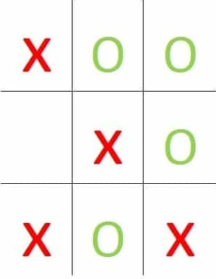



# Introduction

L'apprentissage par renforcement est un paradigme de l'apprentissage automatique
dans lequel un **agent** apprend à prendre les bonnes décisions afin de
maximiser sa récompense. C'est notamment grâce à l'apprentissage par
renforcement que nous avons assisté à la première victoire d'un ordinateur face
au champion du monde de Go (voir [ici](https://deepmind.com/research/case-studies/alphago-the-story-so-far)). 

Dans cet article, nous allons apprendre les bases de l'apprentissage par
renforcement en nous concentrant sur un exemple: le jeu du morpion. Pour cela
nous allons diviser la tâche en quatre parties: 

1. Définition du jeu
2. Définition d'un **agent** (joueur de morpion)
3. Entraînement de deux agents jouant l'un contre l'autre
4. Évaluation des résultats

# 1. Définition du jeu de morpion

Dans cette partie, nous allons définir une classe permettant de garder les
informations sur le jeu en cours. Cette classe aura les objectifs suivants:

* Initialiser le plateau de jeu
* Réinitialiser le plateau après une partie finie
* Décider quand une partie est finie: savoir quand un joueur a gagné, ou quand
il n'existe plus de mouvements possibles (match nul)
* Garder en mémoire la liste des mouvements encore possibles sur la partie en
cours. 
* Définir la récompense à donner à chaque joueur. Nous verrons un peu plus loin
ce qu'est exactement la récompense qui est un concept important dans
l'apprentissage par renforcement. 

Voici alors le code source pour la classe `Morpion`:

```python
import numpy as np
import random
import itertools
from MorpionPlayer import MorpionPlayer

class Morpion():

    def __init__(self, p1, p2):
        self.board = np.array([['-']*3]*3)
        self.symbols = {0: '-', 1: 'x', 2:'o'}

        self.available_actions = \
            list(itertools.product(range(0,3), range(0,3)))

        self.p1 = p1
        self.p2 = p2

    def get_combinations(self):
        """
        Compute all combinations in the current tic-tac-toe board. 

        :returns: All combinations
        :rtype: list(str)

        """

        # Line combinations
        combinations = ["".join(row) for row in self.board]

        # Column combinations
        combinations.extend(["".join(row) for row in self.board.transpose()])

        # Diagonal combinations
        combinations.extend(["".join(row) \
                             for row in [self.board.diagonal(),
                                         np.fliplr(self.board).diagonal()]])
        return combinations
        
    def is_finished(self):
        combinations = self.get_combinations()

        if ((np.all(self.board != '-'))
            or ('xxx' in combinations)
            or ('ooo' in combinations)):
            return True
        return False

    def reset(self):
        self.board = np.array([['-']*3]*3)
        self.available_actions = \
            list(itertools.product(range(0,3), range(0,3)))

        return self.board

    def display(self):
        print(self.board)

    def step(self, action, player):

        # Play action
        self.board[action] = self.symbols[player]

        # Hash the new board
        sp = MorpionPlayer.hash_board(self.board)

        # Remove current action from available actions
        self.available_actions.remove(action)
        
        return sp
    def give_reward(self, train=True):
        combinations = self.get_combinations()
        
        if ('xxx' in combinations):
            if (train):
                self.p1.feed_reward(1)
                self.p2.feed_reward(-1)
                
            self.p1.win += 1
            self.p2.lose +=1
        elif ('ooo' in combinations):
            if (train):
                self.p1.feed_reward(-1)
                self.p2.feed_reward(1)

            self.p1.lose += 1
            self.p2.win += 1
        else:
            if (train):
                self.p1.feed_reward(0.1)
                self.p2.feed_reward(0.1)

            self.p1.draw += 1
            self.p2.draw += 1
```

Comme nous pouvons le voir, nous avons fait le choix d'initialiser un plateau de
jeu sous la forme d'un tableau bidimensionnelle pour lequel nous ferons les
choix suivants: 

* '-' indique une place libre
* 'x' est le symbole du joueur 1
* 'o' est le symbole du joueur 2

Nous avons également initialisé une variable d'instance `available_actions`
gardant en mémoire la liste des mouvements possibles sur la partie en cours. À
l'initialisation de la partie nous avons 9 mouvements possibles (combinaisons
possibles entre les 3 indices de lignes et de colonnes). 

# 2. Définition de l'agent

Avant d'aller plus loin dans le développement de notre jeu de morpion, faisons
une petite introduction aux concepts de l'apprentissage par renforcement. Tout
d'abord, introduisons un peu de vocabulaire: 

* **Agent**: L'apprenant et le preneur de décision. Pour notre exemple, l'agent
sera un joueur de morpion. 
* **Environnement**: L'endroit où l'agent prend ces décisions et décide des
actions à prendre. Ici l'environnement est la partie de Morpion "virtuelle". 
* **État**: L'état de l'agent dans l'environnement. Pour notre exemple, les
états sont les configurations du plateau de jeu. 
* **Action**: Ensemble des actions que l'agent peut réaliser. Pour notre
exemple, l'ensemble des mouvements possibles. 
* **Récompense**: Pour chaque action entreprise par l'agent, une récompense lui
est attribuée par l'environnement. Généralement, la récompense est une valeur
numérique. 
* **Politique**: Fonction -- généralement notée $\pi$ -- qui à chaque état
préconise une action à effectuer.
* **Fonction valeur**: Attribue une valeur à chaque état représentant ce que
l'agent peut espérer de mieux en moyenne s'il choisit cet état. 

Le but de l'apprentissage par renforcement est d'apprendre par l'expérience une
stratégie "comportementale" (la **politique**) en fonctions des échecs et des
succès rencontrés (les **récompenses**). 

## Exploitation versus Exploration:

Pour expliquer la différence entre **exploitation** et **exploration**, prenons
l'exemple suivant: vous avez décidé d'aller boire une bière avec un·e ami·e après le
travail, et vous cherchez un bar. D'habitude, vous allez dans un bar vendant de
très bonnes bières belges, et vous savez qu'il existe une superbe ambiance dans
ce bar. Cependant, cette fois, votre ami·e vous signifie l'existence d'un
nouveau bar venant d'ouvrir au coin de la rue, et ce bar est bien noté sur
l'Internet. Aucun d'entre vous n'arrive à se décider: devez-vous aller dans
votre bar habituel où vous ne serez pas déçu·e ? Ou devez-vous aller dans ce
nouveau bar qui pourrait être mieux ? Ou alors vous décevoir. 

Dans l'apprentissage par renforcement, ce dilemme est connu sous le nom de
**compromis exploration-exploitation**. À quel moment devez vous choisir
**d'exploiter** une action qui vous semble la meilleure option plutôt que
**d'explorer** des actions pouvant être meilleures ou pire. Il existe un
algorithme en apprentissage par renforcement permettant de prendre en compte ce
compromis: l'algorithme **$\epsilon$-greedy**. L'algorithme prend en compte le
compromis **exploration-exploitation** de la manière suivante: 

1. Exploration (action choisie au hasard) avec une probabilité $\epsilon$
2. Exploitation ("meilleure" action) le reste du temps. 

## Apprentissage par différence temporelle

Dans cette partie nous allons discuter de l'algorithme utilisé pour apprendre à
notre agent de jouer au morpion: l'apprentissage par **différence
temporelle**. Dans l'apprentissage par différence temporelle nous allons
estimer la **fonction valeur** $V$ sans s'appuyer sur un modèle, mais sur une
phase d'expérimentation constituée d'un grand nombre d'expériences. Si nous
revenons à notre jeu de morpion, nous allons jouer un grand nombre de partie, et
estimer la fonction valeur relativement aux victoires et défaites rencontrées
par notre agent. 

Il est assez facile d'imaginer qu'au départ notre agent n'a aucune connaissance
des déplacements optimaux. La fonction valeur est initialisée en utilisant des
valeurs aléatoires, ou alors avec des valeurs nulles. Les seules entrées connues
de la fonction valeur seront celles des états finaux, et seront les
**récompenses** attribuées. Pour le jeu de morpion, nous procéderons de la
manière suivante:

* $V(s) = 0$ pour tout état non visité. 
* 
  $$
  V(s_f) 
  = \begin{cases}
  1 \text{ si partie gagnée} \\
  -1 \text{ si partie perdue} \\
  0.1 \text{ si partie nulle}
  \end{cases} 
  $$
  
  où $s_f$ est un état finale (partie finie).
  
**Mise à jour de la fonction valeur:**

La mise à jour de la fonction valeur se fera alors de la manière suivante: 


$$
V(s_t) = V(s_t) + \alpha \left( V(s_{t+1}) - V(s_t) \right)
$$


Cette mise à jour se fera avec une méthode de **rétro-propagation**, c'est-à-dire
que nous partirons de l'état finale pour revenir à l'état initial. Pour notre
jeu de morpion, nous attendrons d'avoir une partie finie pour rétro-propager les
valeurs de la fonction valeur. Pour pouvoir obtenir une fonction valeur
"cohérente", il faudra alors répéter notre expérience jusqu'à l'état final un
grand nombre de fois, et ce pour avoir un maximum d'états et de transitions
connus. 


Voici alors le code pour la définition de l'agent (`MorpionPlayer.py`): 

```python
import itertools
import random

class MorpionPlayer():
    def __init__(self,
                 is_human,
                 player,
                 trainable = True):

        self.is_human = is_human
        self.player = player
        
        self.history = []
        self.V = {}

        self.win = 0
        self.lose = 0
        self.draw = 0
        
        self.eps = 0.99
        self.trainable = trainable

    def reset_stat(self):
        self.win = 0
        self.lose = 0
        self.draw = 0
                
    @staticmethod
    def hash_board(board):
        symbol_to_val = {'-': 0, 'x':1, 'o':2}
        
	hash_board = itertools.chain(*list(board))
        hash_board = list(map(lambda s: symbol_to_val[s], hash_board))

        return sum([x * 3**i for i, x in enumerate(hash_board)])

    def greedy_step(self, game):
        available_actions = game.available_actions
        vmax = -1000
        
        for action in available_actions:
            next_board = game.board.copy()
            next_board[action] = game.symbols[self.player]
            next_board_hash = self.hash_board(next_board)
                        
            
            value = 0 if self.V.get(next_board_hash) is None \
                else self.V.get(next_board_hash)
            
            if (value > vmax):
                vmax = value
                v_action = action

        return v_action
                

    def play(self, game):
        available_actions = game.available_actions
        if self.is_human is False:
            if random.uniform(0, 1) < self.eps:
                action = random.choice(available_actions)
                self.move += 1
            else:
                action = self.greedy_step(game)
                self.greedy_move += 1
        else:
            row = int(input("Ligne: "))
            col = int(input("Colonne: "))

            action = (row, col)

        return action

    def add_state(self, sp):
        self.history.append(sp)

    def feed_reward(self, reward):
        if not self.trainable or self.is_human is True:
            return

        for transition in reversed(self.history):
            sp = transition

            if self.V.get(sp) is None:
                self.V[sp] = 0

            self.V[sp] = self.V[sp] + 0.2 * (reward - self.V[sp])
            reward = self.V[sp]
            

        self.history = []
```

**Fonction `__init__`:**

Initialisation de l'agent. Dans cette méthode, les trois paramètres d'entrées
sont:

* `is_human`: Le joueur est-il une personne réelle ou une IA.
* `player`: Entier permettant de définir le joueur: 1 ou 2
* `trainable`: Est-ce que l'on souhaite entraîner l'agent ? 

L'attribut `history` nous permettra de garder en mémoire l'historique de la
partie, c'est-à-dire les états par lesquels est passé notre agent lors de la
partie en cours. `V` est un dictionnaire permettant de stocker les valeurs de la
fonction valeur. Les attributs `win`, `lose`, et `draw` nous permettront de
stocker les nombres de victoires, défaites et nulles de l'agent. Enfin, `eps`
est la valeur initiale de $\epsilon$ pour l'algorithme $\epsilon$-greedy (ce qui
permettra de faire le compromis entre exploration et exploitation). Au départ,
$\epsilon$ est volontairement grand, puisque nous allons préférer faire de
l'exploration (l'agent ne connaît encore rien des gestes optimaux), mais plus
nous jouerons de partie, plus nous diminuerons $\epsilon$ pour privilégier
l'exploitation. 

**`reset_stat`:**

Remise à zéros des attributs servant à stocker les statistiques de victoires. 

**`hash_board`:**

Méthode statique définissant une fonction de hachage pour les états (différentes
disposition des plateaux de jeu). Cette fonction permet d'associer une valeur
numérique à une certaine disposition de plateau. Pour décrire l'action de cette
fonction de hachage, prenons l'exemple du plateau suivant: 

{: style="text-align:center"}


Nous allons alors réaliser les étapes suivantes:

1. Mise à plat du plateau. Dans l'exemple choisi, nous aurons alors la liste
   ```python
	   ['x', 'o', 'o','-','x','o','x','o','x']
   ```
2. Encodage des symboles en utilisant le dictionnaire `{'-': 0, 'x':1,
   'o':2}`. Pour notre exemple, cela donne:
   ```python
	   ['1', '2', '2','0','1','2','1','2','1']
   ```
   On peut alors voir cette liste comme la représentation en base 3 d'un
   entier. 
3. Conversion en base 10. Pour notre exemple cela nous donne le nombre

$$
1 * 3^0 + 2 * 3^1 + 2 * 3^2 + 0 * 3^3 + 1 * 3^4 + 2 * 3^5 + 1 * 3^6 + 2 * 3^7 +
1 * 3^8 = 12256
$$


Ainsi, le plateau donné en exemple sera encodé avec l'entier 12256

**`greedy_step`:**

Méthode définissant l'étape **d'exploitation** c'est-à-dire le choix par l'agent
de l'action optimale. Afin de faire ce choix, nous cherchons parmi l'ensemble des
actions disponibles l'action maximisant la fonction valeur (récompense
espérée maximale). 

**`play`**:

Méthode permettant à l'agent de jouer son tour dans la partie. Le compromis
exploration-exploitation est alors géré grâce à $\epsilon$ puisque l'agent
jouera de la manière suivante:

* Exploration (choix d'une action aléatoire) si nous tirons un nombre réelle
  inférieur à epsilon. Le tirage est effectué à l'aide d'une loi uniforme
  continue sur l'intervalle $[0,1]$. Ainsi la probabilité que l'agent choisisse
  d'explorer sera égale à $\epsilon$. 
* Exploitation (choix du mouvement "optimal") sinon. Ainsi, l'agent choisira de
  faire de l'exploitation avec une probabilité de 1-$\epsilon$. 

**Suite en cours de construction**
{: .alert .alert-warning}


[](https://mybinder.org/v2/gh/Antoine-Gerard/Projets/master)

<style>
.alert-warning {
  color: rgb(138,109,59) !important;
}
</style>

